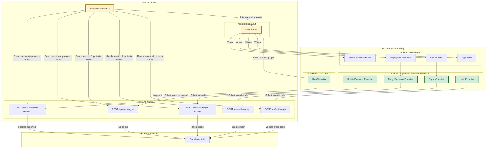

<architecture_analysis>

### 1. Component and Page Listing

Based on the technical specification, the following files will be created or updated to implement the authentication feature:

- **New Pages (Astro)**
  - `src/pages/login.astro`: Renders the login form.
  - `src/pages/signup.astro`: Renders the registration form.
  - `src/pages/forgot-password.astro`: Renders the password recovery form.
  - `src/pages/update-password.astro`: Renders the form to set a new password.

- **New Components (React)**
  - `src/components/auth/LoginForm.tsx`: Manages login form state and API interaction.
  - `src/components/auth/SignupForm.tsx`: Manages registration form state and API interaction.
  - `src/components/auth/ForgotPasswordForm.tsx`: Manages the forgot password form state.
  - `src/components/auth/UpdatePasswordForm.tsx`: Manages the new password form state.
  - `src/components/layout/UserMenu.tsx`: Conditionally displays auth-related navigation links.

- **Updated Files**
  - `src/layouts/Layout.astro`: The main layout will be updated to include the `UserMenu` component.
  - `src/middleware/index.ts`: Will be updated to manage user sessions and protect application routes.

### 2. Main Pages and Component Relationships

- The `login.astro` page will render the `LoginForm.tsx` component.
- The `signup.astro` page will render the `SignupForm.tsx` component.
- The `forgot-password.astro` page will render the `ForgotPasswordForm.tsx` component.
- The `update-password.astro` page will render the `UpdatePasswordForm.tsx` component.
- All pages in the application will use the main `Layout.astro`, which will in turn render the `UserMenu.tsx` component to provide consistent navigation.

### 3. Data and Control Flow

1.  A user navigates to an application page.
2.  The **Middleware** (`src/middleware/index.ts`) intercepts the request to check for a valid session cookie. If a session exists, user data is attached to `Astro.locals`. If the route is protected and no session exists, the user is redirected to `/login`.
3.  The requested **Astro Page** (e.g., `login.astro`) is server-rendered.
4.  The page uses the main **Layout** (`src/layouts/Layout.astro`), which reads the authentication state from `Astro.locals`.
5.  The Layout passes the authentication state as a prop to the **UserMenu** (`src/components/layout/UserMenu.tsx`) component.
6.  The `UserMenu` component conditionally renders the appropriate links: "Login" & "Sign Up" for unauthenticated users, or "My Plans" & "Logout" for authenticated users.
7.  The **React Auth Form** (e.g., `LoginForm.tsx`) on the page handles user input and performs client-side validation.
8.  Upon submission, the form component sends a request to the corresponding **API Endpoint** (e.g., `POST /api/auth/login`).
9.  The API endpoint handles server-side validation and communicates with the **Supabase Auth** service.
10. On a successful response, the form component redirects the user to the appropriate page (e.g., the dashboard). On failure, it displays an error message within the form.

### 4. Component Functionality Overview

- **Astro Pages** (`login.astro`, `signup.astro`, etc.): Act as static hosts for the interactive React form components, creating "islands of interactivity."
- **React Forms** (`LoginForm.tsx`, `SignupForm.tsx`, etc.): Encapsulate all client-side logic, including state management, validation, API communication, and error handling for the authentication forms.
- **UserMenu.tsx**: A presentational component that provides navigation, changing its content based on the user's authentication status.
- **Layout.astro**: The central layout responsible for the overall page structure and for integrating the `UserMenu` with the correct authentication state.
- **middleware/index.ts**: A critical server-side component for managing sessions and enforcing route protection across the entire application.
  </architecture_analysis>

<mermaid_diagram>

</mermaid_diagram>
